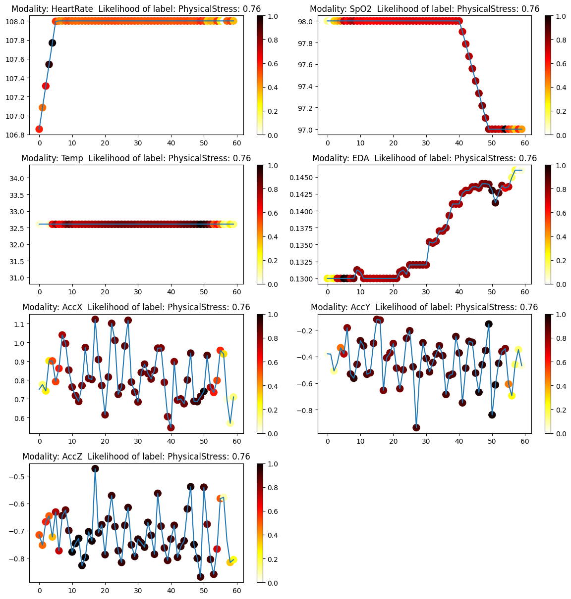
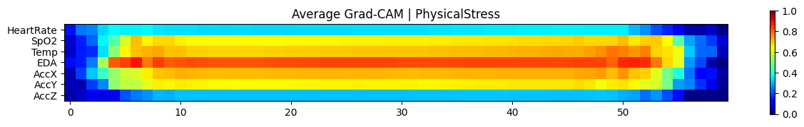

# Explainable AI for Non-EEG Data Analysis

This repository is dedicated to the analysis and visualization of Non-EEG biomedical data [(non-EEG)](https://physionet.org/content/noneeg/1.0.0 ) through Explainable AI techniques. The goal is to provide a clear understanding of the factors that influence the predictions made by machine learning models in the domain of biomedical signal analysis.

## Getting Started

To get a local copy up and running, follow these simple steps:

### Prerequisites

Ensure that you have the following installed:
- Python 3.6 or later
- pip (Python package installer)

### Installation

1. Clone the repository:

    ```sh
    git clone https://github.com/dheerajpr97/Explainable-AI-Non-EEG.git
    ```

2. Navigate to the cloned repository directory:

    ```sh
    cd EXPLAINABLE-AI-NON-EEG
    ```

3. Install the necessary Python packages:

    ```sh
    pip install -r requirements.txt
    ```

## Grad-CAM Visualization

Grad-CAM is an advanced technique that helps in visualizing the regions of the input that are important for predictions from Convolutional Neural Networks (CNNs). It uses the gradients flowing into the last convolutional layer of the model to produce a heatmap highlighting the significant areas contributing to the model's decision.

## Example Visualization

Below is an example of a Grad-CAM heatmap generated for 'Physical Stress' class:

### Grad-CAM Visualization Examples







*The heatmap colors range from blue (low relevance) to red (high relevance), indicating the model's focus areas for the given prediction.*    

## Test the application
    streamlit run app.py

The command starts the Streamlit server and serves the Streamlit application defined in app.py for interactive use in a web browser.

## Docker Container

This repo also includes a Dockerfile which allows you to build a Docker image of the application. This can simplify the setup and ensure consistency across different environments.

### Building the Docker Image

To build the Docker image, ensure you have Docker installed and then run the following command from the project's root directory:

```sh
docker build -t explainable-ai-non-eeg . 
```

### Running the Docker Container

```sh
docker run -p 8501:8501 explainable-ai-non-eeg
```

### Accessing the Streamlit App

This will start a container from the image and map port 8501 inside the container to port 8501 on your host machine. Once the container is running, you can access the Streamlit app by navigating to http://localhost:8501 in your web browser.

